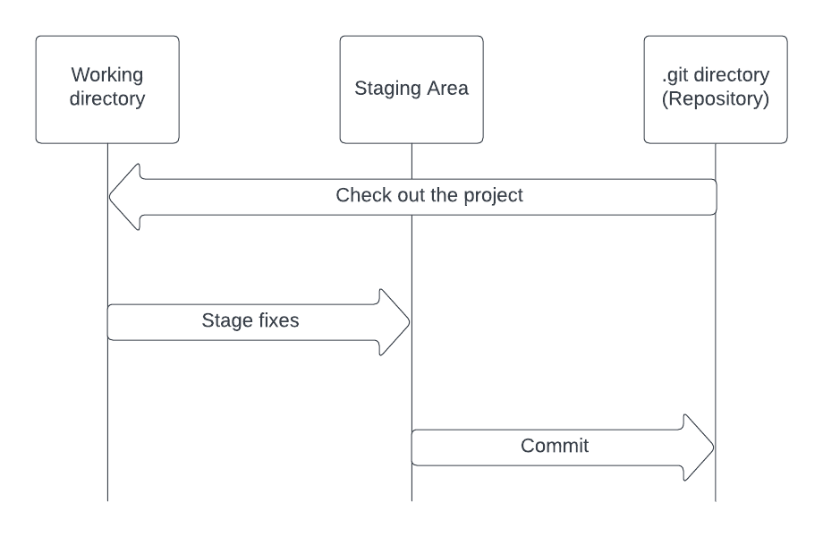

# What is git?
## Git overview

* Git is a version control system that manages project data by storing snapshots of files within a project
* The difference between git and other version control systems, is that it store data as snapshots rather than file based changes
## Core concepts
* Git operates with snapshots, think of each commit as a picture of the project at a specific moment
* Majority of git repositories are local and dont require internet access
## Three main states
* Git tracks three main states of files: Modified (changed but not committed), Staged (marked for the next commit), and Committed (safely stored in the local database).
* The basic Git workflow involves modifying files in the working tree, staging specific changes for the next commit, and then committing these changes to permanently store the snapshot in the Git directory.

