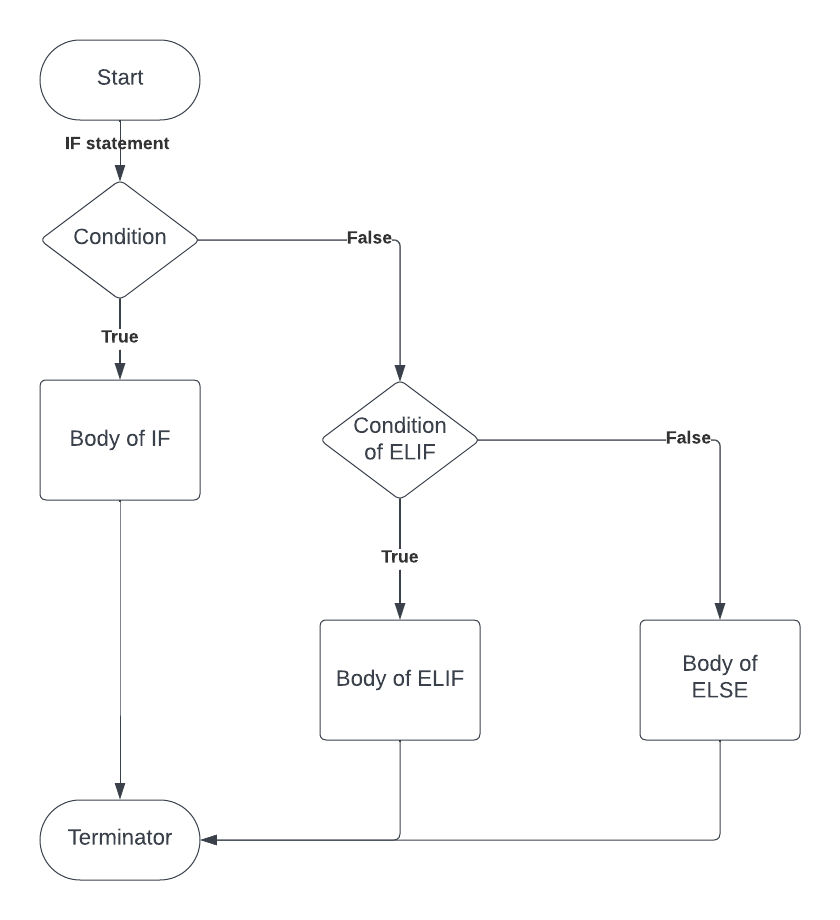
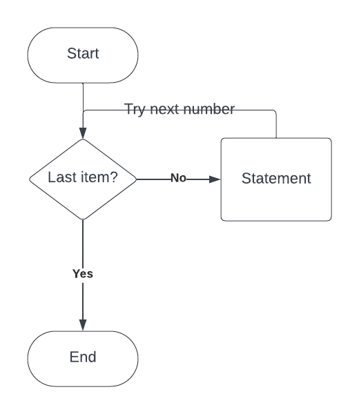
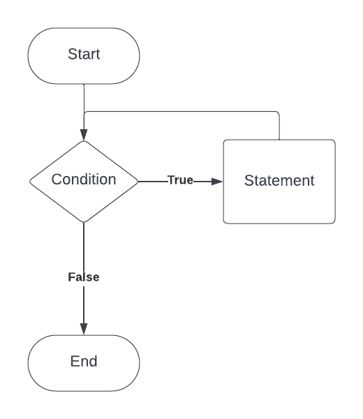

# Control Flow
Used to control the flow of your code, by making decisions
Check if conditions are true before you run a piece of code. Can think of each control flow statement as a boolean.
### IF statements
Do if 'if condition' is satisfied
```python
film_rating = "S"
if film_rating.lower() == "u":
    print("All age groups can watch this movie")
```
### ELIF statements
Less processing power and runs only if 'if condition' is not met.
```python
elif film_rating.lower() == "pg":
    print("Parental guidance is advised for this movie")
elif film_rating.lower() == "12" or film_rating.lower() == "12a":
    print("People aged 12 or over can watch this movie unsupervised. Younger people must be supervised.")
elif film_rating.lower() == "15":
    print("People aged 15 or over can watch this movie")
elif film_rating.lower() == "18":
    print("People aged 18 can watch this movie")
```
### Else
If all else is not satisfied, else is used at the end to ensure an output is produced
```python
else:
    print("This not a valid rating, please use 'u', 'pg','12' or '12a', '15', '18'")
```
In Python there are no Switch statements or case statements. Python is nice and simple.
## Diagram for if, else and elif


# For loops
For loops in Python are used to iterate over a sequence (such as a list, tuple, or string) and execute a set of statements for each item in the sequence.
```python
# Python uses for only, no for each loops

list_data = [1, 2, 3, 4, 5]
embedded_lists = [[1, 2, 3], [4, 5, 6]]
dict_data = {
    1: {"name": "Bronson",
        "money": "£0.05"},
    2: {"name": "Masha",
        "money": "£3.66"},
    3: {"name": "Roscoe",
        "money": "£1.14"}
}
# Prints all items in list_data multiplied by 2
for num in list_data:
   print(num * 2)
```
### Nested for loops
```python
# nested for loops - used to reach items in sub collections
for data in embedded_lists:
    print(data)
    for num in data:
        print(num)
```
### Looping through dictionaries
```python
#Prints all items in all dictonaries
for item in dict_data.values():
    for embed_value in item.values():
        print(embed_value)

# get values for individual keys

for items in dict_data.values():
    print(items["money"])
```
### Combining IFs and FORs
```python
# Checks for all instances of the number 3 in the list, and outputs accordingly
for num in list_data:
    if num == 3:
        print("I found 3!")
    elif num > 3:
        print("Gone too far")
    else:
        print("Too soon!")
```
## Diagram for 'for loops'

# While loops
For loops are to do with iterating through a collection. While loops are more like a monitor -> while something is true then act.
```python
# Basic while loop. The program iterates and prints outputs until x is equal to 4
x = 0

while x < 10:
    print(f"It's working --> {x}")
    if x ==4:
        #Break out of loop when 4 is reached
        break
    x += 1
```
### Verifying user input
We can use while loops to check if user input is valid. Here we start in a state of true, and until the user inputs a digit under the age of 118, we will continue to prompt the user.
```python 
user_prompt = True
while user_prompt:
    age = input("What is your age?")
    # Checks to ensure a valid age is input
    if age.isdigit() and int(age) < 118:
        user_prompt = False
    else:
        print("Please provide your answer in digits below 118")

print (f"Your age is {age}")
```
## Diagram for while loops
