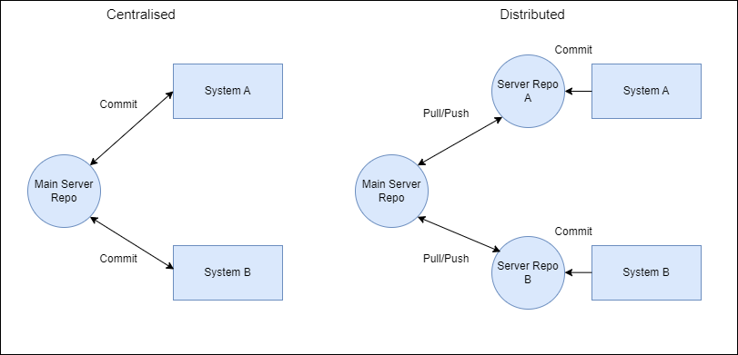

# Git  Guide

This guide will walk you through the basic steps of using Git for version control

## Step 1: Initializing a Git Repository

To start using Git in a project, you need to initialize a Git repository. Navigate to your project's root directory using the command line and run the following command:

```bash
git init
```
## Step 2: Adding Files to the Staging Area
Before you commit changes, you need to add files to the staging area. The staging area is where you prepare your changes for a commit. To add a file to the staging area, use the following command:
```bash
git add <file-name>
```
You can also add all files at once using: ``git add . ``
## Step 3: Committing changes
Once your files are in the staging area, you can commit them, typically, with a message.
```bash
git commit -m "Your commit message here"
```
## Step 4: Pushing Changes to a Remote Repository
If you have a remote repository, like GitHub, you can push your commited changes to it by using:
```bash
git remote add origin https://github.com/Your-Name/repositoryName.git
git branch -M main
git push -u origin main
```
You have now successfully initialized a Git repository, added files to the staging area, committed changes, and pushed those changes to a remote repository.

