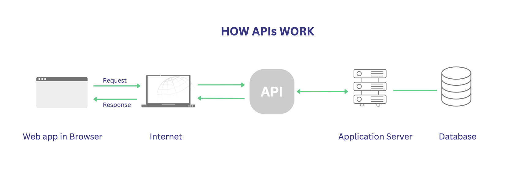

# Understanding APIs and HTTP

## What are API’s? How are they used and why are they so popular?

API stands for Application Programming Interface. APIs are used to enable the exchange of data and functionality between different systems or services. They are popular because they allow developers to to use  existing software components, access data from various sources, and build more complex applications quickly and efficiently.

## What is a REST API? What makes an API RESTful?

RESTful APIs use HTTP requests to perform CRUD (Create, Read, Update, Delete) operations on resources. They are stateless which means each request from a client to the server must contain all the information needed to understand and process the request. 

## What is HTTP? (what does it stand for and what is it used for? What is HTTPS?)

HTTP stands for Hypertext Transfer Protocol. It is a protocol used for transmitting data over the internet. It defines how messages are formatted and transmitted, as well as how web servers and browsers should respond to various commands. HTTPS is a secure version of HTTP that encrypts the data transmitted between the client and server.

## Explain HTTP response structure using the diagram provided.
* The first line of the response contains the HTTP version, a three-digit status code, and a reason phrase. For example, "HTTP/1.1 200 OK" indicates a successful response.
* HTTP response headers provide additional information about the response.
*  The response body contains the actual data or content being sent from the server to the client. It can be in various formats, such as HTML, JSON, or plain text as show in the diagram below.

## What are the 5 HTTP verbs and what do they do? GET, POST, PUT, PATCH, DELETE

- **GET**: Used to retrieve data from a specified resource.
- **POST**: Used to create a new resource or submit data to be processed. 
- **PUT**: Used to update an existing resource or create it if it doesn't exist.
- **PATCH**: Used to partially update an existing resource. 
- **DELETE**: Used to delete a specified resource.

## What is statelessness?

Statelessness means that each request from a client to a server must contain all the information needed to understand and process the request. Each request is independent and does not rely on previous requests.

## What is caching?

Caching is a technique used to store and reuse previously fetched or computed data to improve performance and reduce the load on a server or database. When a client requests data from a server, the server may store a copy of the response in a cache. If the same request is then made again, the server can return the cached data instead of fetching it from the source saving resources.